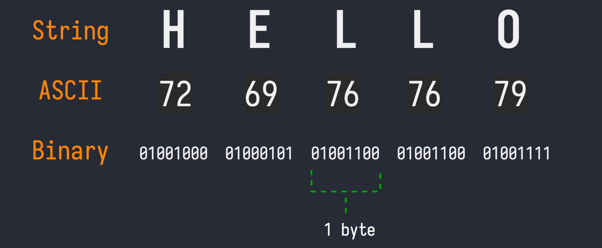

# ASCII, Unicode, UTF

### ASCII

[https://www.ascii-code.com/](https://www.ascii-code.com/)

В начале содержала 128 символов:

- Символы с кодами 0-31 были непечатаемы и использовались для контроля периферии, например, принтера:
    
    > *0* - *NUL, 27 - ESC, 8 - BS (backspace)*
    > 

- Символы с кодами 32-127 печатались на экране, это были символы английского алфавита, знаки пунктуации, цифры
    
    > *32 - SP (space), 33 - !, 65 - A*
    > 

Во многих языках программирования **обратный слэш \** используется для обозначения символов, которые следует обработать особым образом:

> *\t - HT [9], \n - LF [10]; 
\a - BEL [7], \b - BS [8];*
> 

```bash
# -e: Enable interpretation of backslash escapes (special characters)
echo -e "\a"      # bell sound
echo -e "abc\bd"  # abd
```

```python
print("124\b3")  # 123
```

```go
fmt.Println("\a")
fmt.Println("abc\td")
```

Поведение, во время исполнения этих служебных кодов, может отличаться от устройства к устройству.



Так как размер таблицы 128 символов, то вся таблица представляется с помощью 7 бит. Но мы не можем управлять битами по отдельности, поэтому, на любой ASCII-символ будет выделяться 1 байт.

<aside>
Процесс конвертации объекта в его хранимое бинарное представление называется **кодировкой** - encoding.

Процесс восстановления объекта по его бинарному представлению называется расшифровкой - decoding.

</aside>

**ASCII** была создана тогда, когда первые компьютеры находились в англо-говорящих странах. 

Когда же остальные страны начали развивать у себя компьютерные технологоии, им стало не хватать стандартной таблицы и они стали придумывать собственные кодировки. 

Например, **KOI-8**, которая была разработана для хранения букв кириллического алфавита.

Вместе с этим возникла другая проблема: кодировок стало слишком много; чтобы прочитать информацию, компьютеру получателя требовалось установить необходимый символьный пакет, ведь иначе они не отображались.

Так, на свет появился стандарт, объединяющий многие страны. Он назывался **Unicode**.

### Unicode

В лингвистике, слово графема *(grapheme)* использовалось вместо слова символ.

Это из-за того, что слово символ *(character)* могло обозначать разные вещи.

> Графема - графический элемент, который читатель преобразует в минимальную единицу письменности.
> 

Ниже приведены примеры графем для английского, хинди, китайского и эмодзи:


Графемы представлены в таблцы с использованием одного Юникод-элемента.

Но есть графемы, которые представляются несколькими Юникод-элементами:


В **ASCII** мы распоряжались 128 кодами символов, тогда как **Unicode** мапит символы в рэндже: 0 → 0x10FFFF.

Это очень большой рэндж, он содержит в себе 1 114 112 элементов.

**Unicode Code Points**

Стоит отметить, что первые 128 символов **Unicode** совпадают с таблицей **ASCII**; более того, сразу же сопоставляет им код-поинты Юникода.

**Unicode** так же определяет направление текста (слева-направо, справа-налево, сверху-вниз, снизу-вверх.

<aside>
Unicode не содержит в себе кодировку. Это стандарт, который мапит графемы и их бинарные представления.

</aside>

<aside>
Для меня было откровением, что в **Unicode** можно буквы "й" и "ё" записать 
по-разному - одним символом и двумя символами ("и" + глиф, "е" + глиф):

- Размер разный
- Двойной клик на слове с такими "слепленными" "й" и "ё" выделяет только половину слова

плойка - 1 символ

плойка - 2 символа

</aside>

### UTF Encoding

Компьютеры хранят и передают данные в бинарном формате. Конвертация из графем в бинарь также называется кодировкой - encoding.

*Теперь слово - “кодировка” - наконец обретает смысл и вес)*

В **ASCII** все было просто, так как любой символ можно было представить с помощью 7 бит, мы использовали 1 байт для хранения кода в таблице.

Однако, из-за того, что **Unicode** гораздо объемнее, одного байта будет недостаточно.

Существует множество различных схем (schemes) для **Unicode**. Каждая из них имеет свои плюсы и минусы, использует разное количество байтовых последовательностей для представления Юникод-значения.

Так, **UTF-32** это одна из схем для **Unicode.**


> **UTF** означает Unicode Transformation Format

UTF-32 использует 32 бита или же 4 байта для представления Юникод-символа.

Плюсы: все графемы будут занимать фиксированный размер в 4 байта

Минусы: потребляет много памяти


Это имеет большое значение, так как часто английские графемы из **Unicode** используются чаще всего. 

Даже если представить какой-нибудь индийский или китайский сайт, все его строительные компоненты (html, css, js) будут использовать символы из английского алфавита, скорее всего, больше, чем сам контент на искомом языке.

### UTF-8

В отличии от статичного большого и оверкильного UTF-32, эта кодировка динамична.

UTF-8 использует от 1 до 4 байтов для представления каждого символа. Базовые латинские символы представлены одним байтом, что делает UTF-8 обратно совместимым с **ASCII**.

**Как работает UTF-8?** 

что я понял:

- юникод это просто мапа символа (графемы) и шестнадцатиричного числа (U+hex) - Unicode Code Point; например “A” и его кодпоинт U+0041
- кодировка юникода это метод преобразования UCP в бинарную последовательность (напр., UTF-8, UTF-16, ...)

еще больше:

1. UTF-8, кодировка переменной длины. Кодировкой, выбор отводимого под символ кол-ва байт осуществляется с помощью подсчета длины битов UCP числа в его бинарном виде
2. **ASCII** - это одновременно таблица символов, как Unicode, и кодировка, потому как символы сразу мапятся с бинарными последовательностями


Тут нолики и единички используются для обозначения паттернов, выделения нужного количества байтов на символ. Иксами являются значимые values символов.

**Минус такой кодировки:** из-за того, что конвертация из кодпоинтов в байты дает переменную длину, нам становится сложнее индексировать буквы в строке.

### Строки в Go, Python

**Golang**

Стандартный рэндж в **Go** итерируется по кодпоинтам, по сути по байтам.

```go
data := "Араз"  // UTF-8 by default
for index, char := range data {
	fmt.Printf("%d : %c\n", index, char)
}

/*
0 : А
2 : р
4 : а
6 : з
*/

fmt.Printf("%c\n", data[0])   // Ð

```

**Golang** покажет символ, соответствующий байту под этим индексом. 

Но так как в **UTF-8** один символ может занимать больше, чем один байт, то голанг может вывести не тот символ, что мы ожидаем.

Для верного вывода нужно указать рэндж байтов.

```go
fmt.Printf("%s\n", data[0:2]) // A
```

**Python**

Он также воспринимает строки в схеме **UTF-8**. 

Но, в отличие от **Go**, питон сможет итерироваться по каждому символу и его индекс будет увеличиваться соответственно.

```python
data = "Араз"
for i, c in enumerate(data):
	print(i, c)

# 0 А
# 1 р
# 2 а
# 3 з

print(data[0])  # А
```

Также он может индексировать строку, а не лежащий под ней byte-array.

Ну и еще пару интересных моментов:

```python
# напечатать все выводимые глифы
unicode_max = 0x10ffff
printable_glyphs = [ chr(x) for x in range(0, unicode_max+1) if chr(x).isprintable() ]
print(len(printable_glyphs))
```

```python
# кодирование и декодирование символов в разных кодировках
import unicodedata
monkey = unicodedata.lookup('monkey')

print(f"""
    glyph: {monkey}
    codepoint: Dec: {ord(monkey)}
    codepoint: Hex:  {hex(ord(monkey))}

    utf8: { monkey.encode('utf8', errors='strict') }
    utf16: { monkey.encode('utf16', errors='strict') }
    utf32: { monkey.encode('utf32', errors='strict') }
""")

'''
glyph: 🐒
codepoint: Dec: 128018
codepoint: Hex:  0x1f412

 utf8: b'\xf0\x9f\x90\x92'
utf16: b'\xff\xfe=\xd8\x12\xdc'
utf32: b'\xff\xfe\x00\x00\x12\xf4\x01\x00'
'''

print(b'\xf0\x9f\x90\x92'.decode('utf-8'))  # 🐒
```
